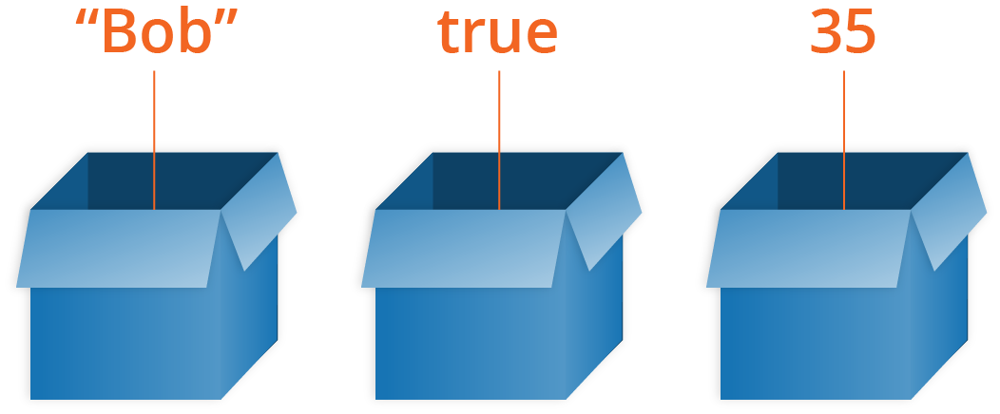

# Variables

Большинству программ нужно отслеживать то, как меняется значение на протяжении выполнения программы проходя через различные операции, вызываемые для соответствующих задач вашей программы.

Самый простой путь сделать это в программе — присвоить значение символьному контейнеру, называемому _переменной \(variable\)_, т.к. при необходимости значение в этом контейнере может _меняться _с течением времени.



В некоторых языках программирования вы определяете переменную \(контейнер\), чтобы хранить определенный тип значения, такой как`число`или`строка`. _**Статическая типизация**_, также известная как _контроль типов_, обычно упоминается как преимущество в корректности программы, предотвращая непредусмотренные преобразования значений.

Другие языки выводят типы для значений вместо переменных. _**Слабая типизация**_, также известная как _**динамическая типизация**_, позволяет переменной хранить значения любого типа в любое время. Это обычно упоминается как преимущество в гибкости программы, позволяя одной переменной представлять значение вне зависимости от того, в форме какого типа это значение может понадобиться в любой момент выполнения программы.

JavaScript использует второй подход: _динамическую типизацию_, что означает, что переменные могут хранить значения любого _типа _без какого-либо контроля _типов._

## Имя переменной

Вы можете использовать переменные как символические имена для значений в вашем приложении. Имена переменных называются [identifiers](https://developer.mozilla.org/ru/docs/Словарь/Identifier) и должны соответствовать определенным правилам.

Идентификатор в JavaScript должен начинаться с буквы, нижнего подчеркивания \(\_\) или знака доллара \($\); последующие символы могут также быть цифрами \(0-9\). Поскольку JavaScript чувствителен к регистру, буквы включают символы от "A" до "Z" \(верхний регистр\) и символы от "a" до "z" \(нижний регистр\).

Вы можете использовать в идентификаторах буквы ISO 8859-1 или Unicode, например, å или ü. Вы также можете использовать [управляющие последовательности Unicode](https://developer.mozilla.org/ru/docs/Web/JavaScript/Reference/Lexical_grammar#String_literals) как символы в идентификаторах.

В общем-то, те же правила, применяемые к идентификатору переменной, применяются и к имени свойства. Однако определенные слова не используются как переменные, но могут использоваться как имена свойств. Эти слова называются "зарезервированными словами" и включают ключевые слова JS \(`for`,`in`,`if`и т.д.\), включая и`null`,`true`и`false`.

Некоторые примеры корректных имен: `Number_hits`, `temp99`, `_name`.

### Рекомендации по именования переменных {#Правила_именования_переменных}

Вы можете назвать переменную как угодно, но есть ограничения. Как правило, вы должны придерживаться только латинских символов \(0-9, a-z, A-Z\) и символа подчеркивания.

* Не используйте символы подчеркивания в начале имен переменных, т.к они используются в некоторых конструкциях JavaScript для обозначения конкретных вещей, поэтому можно запутаться.
* Не используйте числа в начале переменных. Это недопустимо и приведет к ошибке.
* Общепринято придерживаться так называемого ["lower camel case"](https://en.wikipedia.org/wiki/CamelCase#Variations_and_synonyms), где вы склеиваете несколько слов, используя строчные буквы для целого первого слова, а затем заглавные буквы следующих слов. Мы использовали для наших имен переменные в данной статье.
* Делайте имена переменных такими, чтобы было интуитивно понятно, какие данные они содержат. Не используйте только отдельные буквы / цифры или большие длинные фразы.

## Объявление переменных

В JavaScript существует три вида объявлений переменных:

[`var`](https://developer.mozilla.org/ru/docs/Web/JavaScript/Reference/Statements/var) - Объявляет переменную, инициализация переменной значением является необязательной.

[`let`](https://developer.mozilla.org/ru/docs/Web/JavaScript/Reference/Statements/let) - Объявляет локальную переменную в области видимости блока, инициализация переменной значением является необязательной.

[`const`](https://developer.mozilla.org/ru/docs/Web/JavaScript/Reference/Statements/const) - Объявляет именованную константу, доступную только для чтения.

Переменные можно объявить следующими способами:

* Используя ключевое слово [`var`](https://developer.mozilla.org/ru/docs/Web/JavaScript/Reference/Statements/var). Например, `var x = 42`. Данный синтаксис может быть использован для объявления как локальных, так и глобальных переменных.
* Просто присвоить переменной значение. Например, `x = 42`. Переменные, объявленные данным способом, являются глобальными. Такое объявление генерирует [строгое предупреждение](https://developer.mozilla.org/ru/docs/Web/JavaScript/Reference/Strict_mode) \([strict mode](https://developer.mozilla.org/ru/docs/Web/JavaScript/Reference/Strict_mode)\). Не рекомендуется использовать данный способ.
* Используя ключевое слово [`let`](https://developer.mozilla.org/ru/docs/Web/JavaScript/Reference/Statements/let). Например, `let y = 13`. Данный синтаксис может быть использован для объявления локальной переменной в области видимости блока.

В обычном режиме выполнения JavaScript опечатка в имени переменной во время присваивания приводит к созданию нового свойства глобального объекта, и выполнение продолжается \(хотя в современном JavaScript оно, вероятно, аварийно завершится далее\). Присваивания, которые могут случайно создать глобальную переменную, в строгом режиме \(s[trict mode](../../additional.md)\) выбрасывают исключение:

```javascript
"use strict";
mistypedVaraible = 17; // выдаст ReferenceError
```

## Присваивание переменных

Переменная, объявленная через `var` или `let` без присвоения начального значения, имеет значение [`undefined`](https://developer.mozilla.org/ru/docs/Web/JavaScript/Reference/Global_Objects/undefined). При попытке доступа к необъявленной переменной или переменной до её объявления будет выброшено исключение [`ReferenceError`](https://developer.mozilla.org/ru/docs/Web/JavaScript/Reference/Global_Objects/ReferenceError):​

```javascript
var a;
console.log("The value of a is " + a); //Значение переменной a undefined

console.log("The value of b is " + b); //Uncaught ReferenceError: b не определена

console.log("The value of c is " + c); //Значение переменной c undefined
var c;

console.log("The value of x is " + x); //Uncaught ReferenceError: x не определена
let x;
```

Когда переменной присваивается значение, вы можете изменить \(обновить\) это значение, просто указав другое значение. Попробуйте ввести следующие строки в консоль:

```javascript
myName = 'Bob';
myAge = 40;
```

Cтрогий режим заставляет присваивания, которые все равно завершились бы неудачей, выбрасывать исключения. Например, NaN -- глобальная переменная, защищенная от записи. В обычном режиме присваивание NaN-значения ничего не делает; разработчик не получает никакого сообщения об ошибке. В строгом режиме присваивание значения NaN выбрасывает исключение. Любое присваивание, которое в обычном режиме завершается неудачей \(присваивание значения свойству, защищенному от записи; присваивание значения свойству, доступному только для чтения; присваивание нового свойства [нерасширяемому](https://developer.mozilla.org/ru/docs/Web/JavaScript/Reference/Global_Objects/Object/preventExtensions) объекту\) в строгом режиме выбросит исключение:

```javascript
"use strict";

// Присвоение non-writable свойства
var obj1 = {};
Object.defineProperty(obj1, "x", { value: 42, writable: false });
obj1.x = 9; // выдаст TypeError

// Присвоение getter-only свойства
var obj2 = { get x() { return 17; } };
obj2.x = 5; // выдаст TypeError

// Присвоение нового свойства non-extensible объекту
var fixed = {};
Object.preventExtensions(fixed);
fixed.newProp = "ohai"; // выдаст TypeError
```

## Область видимости переменных

Когда вы объявляете переменную вне функции, то такая переменная называется _глобальной _переменной, т.к. доступна любому коду в текущем документе. Когда вы объявляете переменную внутри функции, то такая переменная называется _локальной _переменной, т.к. доступна только внутри данной функции.

До ECMAScript 6 в JavaScript отсутствовала область видимости [блока](https://developer.mozilla.org/ru/docs/Web/JavaScript/Guide/Statements); переменная, объявленная внутри блока, является локальной для _**функции**_ \(или _глобальной _области видимости\), внутри которой находится данный блок. Например, следующий код выведет значение 5, т.к. областью видимости переменной `x` является функция \(или глобальный контекст\), внутри которой объявлена переменная `x`, а _**не блок**, _которым в данном случае является оператор `if`:

```javascript
if (true) {
  var x = 5;
}
console.log(x); // 5
```

Такое поведение меняется, если используется оператор`let`, введенный в ECMAScript 6:

```javascript
if (true) {
  let y = 5;
}
console.log(y); // ReferenceError
```

### Поднятие переменных {#Поднятие_переменных}

Вы используете ключевое слово`var`, чтобы объявить переменную, которая принадлежит области видимости текущей функции или глобальной области, если находится на верхнем уровне вне любой функции.

Где бы ни появлялось `var` внутри области видимости, это объявление принадлежит всей области видимости и доступно в ней повсюду.

Это поведение называется _поднятие \(hoisting\)_, когда объявление `var` концептуально "перемещается" на вершину своей объемлющей области видимости. Технически этот процесс более точно объясняется тем, как компилируется код, но сейчас опустим эти подробности.

Пример:

```javascript
var a = 2;

foo();                    // работает, так как определение `foo()`
                        // "всплыло"

function foo() {
    a = 3;

    console.log( a );    // 3

    var a;                // определение "всплыло"
                        // наверх `foo()`
}

console.log( a );    // 2
```

Не общепринято и не так уж здраво полагаться на _поднятие _переменной, чтобы использовать переменную в ее области видимости раньше, чем появится ее объявление `var`: такое может сбить с толку. Общепринято и приемлемо использовать _всплытие _объявлений функций, что мы и делали с вызовом `foo()`, появившимся до ее объявления.

#### Вложенные области видимости

Когда вы объявляете переменную, она доступна повсюду в области ее видимости так же, как и в более нижних/внутренних областях видимости. Например:

```javascript
function foo() {
    var a = 1;

    function bar() {
        var b = 2;

        function baz() {
            var c = 3;

            console.log( a, b, c );    // 1 2 3
        }

        baz();
        console.log( a, b );        // 1 2
    }

    bar();
    console.log( a );                // 1
}

foo();
```

Заметьте, что`c`недоступна внутри `bar()`, потому что она объявлена только внутри внутренней области видимости`baz()`и`b`недоступна в`foo()`по той же причине.

Если вы попытаетесь получить доступ к значению переменной в области видимости, где она уже недоступна, вы получите `ReferenceError`. Если вы попытаетесь установить значение переменной, которая еще не объявлена, у вас закончится все тем, что переменная создастся в самой верхней глобальной области видимости \(плохо!\), либо получите ошибку в зависимости от "строгого режима" \(см. "Строгий режим"\). Давайте посмотрим:

```javascript
function foo() {
    a = 1;    // `a` формально не объявлена
}

foo();
a;            // 11
```

Это очень плохая практика. Не делайте так! Всегда явно объявляйте свои переменные.

В дополнение к созданию объявлений переменных на уровне функций, ES6 _позволяет _вам объявлять переменные, принадлежащие отдельным блокам \(пара`{ .. }`\), используя ключевое слово `let`. Кроме некоторых едва уловимых деталей, правила области видимости будут вести себя точно так же, как мы видели в функциях:

```javascript
function foo() {
    var a = 1;

    if (a >= 1) {
        let b = 2;

        while (b < 5) {
            let c = b * 2;
            b++;

            console.log( a + c );
        }
    }
}

foo();
// 5 7 9
```

Из-за использования `let` вместо `var`,`b` будет принадлежать только оператору `if` и, следовательно, не всей области видимости функции `foo()`. Точно так же `c` принадлежит только циклу `while`. Блочная область видимости очень полезна для управления областями ваших переменных более точно, что может сделать ваш код более легким в обслуживании в долгосрочной перспективе.

### Источники:

1. [You don't know js](https://github.com/getify/You-Dont-Know-JS/blob/master/up%20%26%20going/ch2.md#variables)
2. [MDN](https://developer.mozilla.org/en-US/docs/Web/JavaScript/Guide/Grammar_and_Types)

