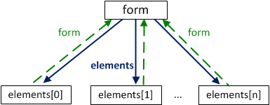

# Controls

Элементы управления, такие как`<form>`,`<input>`и другие имеют большое количество своих важных свойств и ссылок.

## Псевдомассив form.elements

Элементы`FORM`можно получить по имени или номеру, используя свойство`document.forms[name/index]`.

Например:

```javascript
document.forms.my -- форма с именем 'my'
document.forms[0] -- первая форма в документе
```

**Любой **_**элемент **_**формы**`form`**можно получить аналогичным образом, используя свойство**`form.elements`**.**



Например:

```text
<body>
  <form name="my">
    <input name="one" value="1">
    <input name="two" value="2">
  </form>

  <script>
    var form = document.forms.my; // можно document.forms[0]

    var elem = form.elements.one; // можно form.elements[0]

    alert( elem.value ); // 1
  </script>
</body>
```

**Может быть несколько элементов с **_**одинаковым именем**_**. В таком случае**`form.elements[name]`**вернет коллекцию элементов**, например:

```text
<body>
<form>
  <input type="radio" name="age" value="10">
  <input type="radio" name="age" value="20">
</form>

<script>
var form = document.forms[0];

var elems = form.elements.age;

alert(elems[0].value); // 10, первый input
</script>
</body>
```

Эти ссылки не зависят от окружающих тегов. Элемент может быть «зарыт» где-то глубоко в форме, но он все равно доступен через`form.elements`.

**Свойство**`elements`**также есть у элементов**`<fieldset>`**. **Вот пример:

```text
<body>
  <form>
    <fieldset name="set">
      <legend>fieldset</legend>
      <input name="text" type="text">
    </fieldset>
  </form>

  <script>
    var form = document.forms[0];

    alert( form.elements.text ); // INPUT
    alert( form.elements.set.elements.text ); // INPUT
  </script>
</body>
```

## Элемент label

Элемент`label`– один из самых важных в формах.

**Клик на**`label`**засчитывается как фокусировка или клик на элементе формы, к которому он относится.**

Это позволяет посетителям кликать на большой красивой метке, а не на маленьком квадратике`input type=checkbox`\(`radio`\). Конечно, это очень удобно.

Есть два способа показать, какой элемент относится к`label`:

Дать метке атрибут`for`, равный`id`соответствующего`input`:

```text
<table>
  <tr>
    <td>
      <label for="agree">Согласен с правилами</label>
    </td>
    <td>
      <input id="agree" type="checkbox">
    </td>
  </tr>
  <tr>
    <td>
      <label for="not-a-robot">Я не робот</label>
    </td>
    <td>
      <input id="not-a-robot" type="checkbox">
    </td>
  </tr>
</table>
```

Завернуть элемент в`label`. В этом случае можно обойтись без дополнительных атрибутов:

```text
<label>Кликни меня <input type="checkbox"></label>
```

